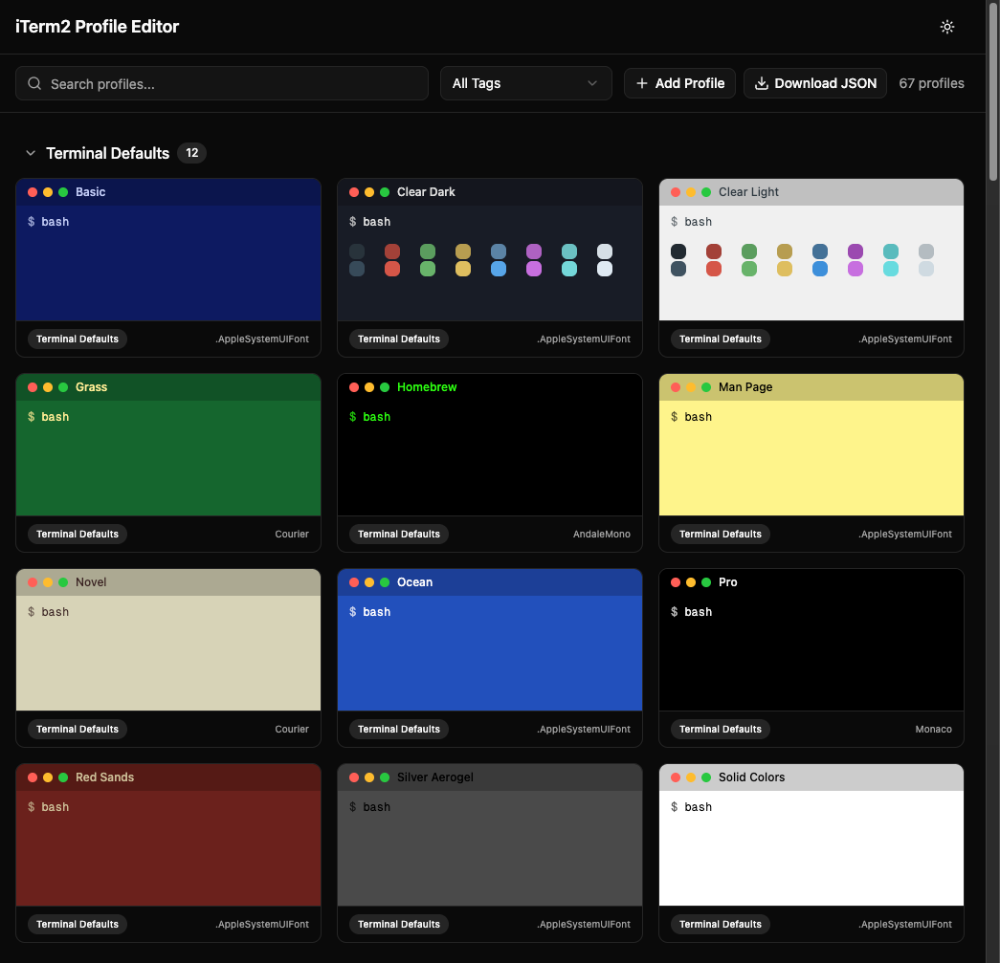

# iTerm2 Profile Editor

A visual web editor for iTerm2 Dynamic Profiles JSON files. Upload your profiles, preview color themes, edit settings, and download the modified file. Everything runs entirely in your browser.

**Live site:** https://iterm2-profile-editor.agagroup.workers.dev



## Features

- **Visual preview** — Terminal mockup cards showing background/foreground colors and ANSI color swatches for each profile
- **Color theme presets** — Apply Dracula, Solarized, Nord, Monokai, One Dark, Gruvbox, Tokyo Night, or Catppuccin Mocha with one click
- **Profile management** — Add, copy, delete, and organize profiles by tags
- **Full settings editor** — Edit colors, fonts, terminal size, cursor, scrollback, commands, and more
- **Bulk operations** — Select multiple profiles to apply themes, add tags, or delete in batch
- **Credential masking** — Passwords and tokens in commands are automatically masked in preview cards
- **Dark/light mode** — Toggle between themes, respects system preference
- **Auto-save** — Changes persist to browser localStorage, restore on next visit
- **Fully client-side** — No server, no uploads, no tracking. Your data never leaves your browser.

## Getting Started

### Prerequisites

- [Node.js](https://nodejs.org) 20+
- [pnpm](https://pnpm.io)

### Development

```bash
pnpm install
pnpm dev
```

### Build

```bash
pnpm build
pnpm preview
```

### Deploy to Cloudflare Pages

```bash
pnpm build
pnpm dlx wrangler pages deploy .svelte-kit/cloudflare --project-name iterm2-profile-editor
```

## Usage

1. **Export your profiles from iTerm2:**
   - iTerm2 → Settings → Profiles → Other Actions → Save All Profiles as JSON
   - Or find them in `~/Library/Application Support/iTerm2/DynamicProfiles/`

2. **Upload** the JSON file (drag & drop or browse)

3. **Edit** — click any profile card to open the full editor with three tabs:
   - **Colors** — 21 color slots with pickers, apply presets
   - **Settings** — Name, tags, font, terminal size, cursor, scrollback, transparency
   - **Command** — Custom shell command, session close behavior

4. **Download** the modified JSON and place it back in iTerm2's DynamicProfiles folder

### Converting from Terminal.app

If migrating from macOS Terminal, you can convert your profiles to iTerm2 format using a Python script that reads the Terminal.app plist and decodes the binary NSColor/NSFont data via the native macOS AppKit bridge.

**Prerequisites:** macOS with Python 3 and PyObjC (ships with the system Python on macOS, or install via `pip install pyobjc`).

**Steps:**

1. Save the conversion script as `convert_terminal_to_iterm2.py`:

```python
#!/usr/bin/env python3
"""Convert macOS Terminal.app profiles to iTerm2 profiles."""

import json, plistlib, uuid, sys, os
import AppKit  # noqa: F401
from Foundation import NSKeyedUnarchiver, NSData
from AppKit import NSColor, NSFont, NSColorSpace


def decode_nscolor(data_bytes):
    """Decode NSKeyedArchiver-encoded NSColor to RGB dict."""
    try:
        nsdata = NSData.dataWithBytes_length_(data_bytes, len(data_bytes))
        color = NSKeyedUnarchiver.unarchiveObjectWithData_(nsdata)
        if color is None:
            return None
        for method in ["NSCalibratedRGBColorSpace", "NSDeviceRGBColorSpace"]:
            try:
                rgb = color.colorUsingColorSpaceName_(method)
                if rgb:
                    return {"Red Component": float(rgb.redComponent()),
                            "Green Component": float(rgb.greenComponent()),
                            "Blue Component": float(rgb.blueComponent()),
                            "Alpha Component": float(rgb.alphaComponent()),
                            "Color Space": "sRGB"}
            except Exception:
                pass
        try:
            rgb = color.colorUsingColorSpace_(NSColorSpace.sRGBColorSpace())
            if rgb:
                return {"Red Component": float(rgb.redComponent()),
                        "Green Component": float(rgb.greenComponent()),
                        "Blue Component": float(rgb.blueComponent()),
                        "Alpha Component": float(rgb.alphaComponent()),
                        "Color Space": "sRGB"}
        except Exception:
            pass
    except Exception as e:
        print(f"  Warning: Could not decode color: {e}", file=sys.stderr)
    return None


def decode_font(data_bytes):
    """Decode NSKeyedArchiver-encoded NSFont to name and size."""
    try:
        nsdata = NSData.dataWithBytes_length_(data_bytes, len(data_bytes))
        font = NSKeyedUnarchiver.unarchiveObjectWithData_(nsdata)
        if font:
            return str(font.fontName()), float(font.pointSize())
    except Exception as e:
        print(f"  Warning: Could not decode font: {e}", file=sys.stderr)
    return None, None


def terminal_to_iterm2_profile(name, settings):
    """Convert a single Terminal.app profile to iTerm2 format."""
    profile = {"Name": name, "Guid": str(uuid.uuid4()).upper(),
               "Dynamic Profile Parent Name": "Default"}
    color_map = {
        "BackgroundColor": "Background Color", "TextColor": "Foreground Color",
        "TextBoldColor": "Bold Color", "CursorColor": "Cursor Color",
        "SelectionColor": "Selection Color",
        "ANSIBlackColor": "Ansi 0 Color", "ANSIRedColor": "Ansi 1 Color",
        "ANSIGreenColor": "Ansi 2 Color", "ANSIYellowColor": "Ansi 3 Color",
        "ANSIBlueColor": "Ansi 4 Color", "ANSIMagentaColor": "Ansi 5 Color",
        "ANSICyanColor": "Ansi 6 Color", "ANSIWhiteColor": "Ansi 7 Color",
        "ANSIBrightBlackColor": "Ansi 8 Color", "ANSIBrightRedColor": "Ansi 9 Color",
        "ANSIBrightGreenColor": "Ansi 10 Color", "ANSIBrightYellowColor": "Ansi 11 Color",
        "ANSIBrightBlueColor": "Ansi 12 Color", "ANSIBrightMagentaColor": "Ansi 13 Color",
        "ANSIBrightCyanColor": "Ansi 14 Color", "ANSIBrightWhiteColor": "Ansi 15 Color",
    }
    for term_key, iterm_key in color_map.items():
        if term_key in settings:
            color = decode_nscolor(settings[term_key])
            if color:
                profile[iterm_key] = color
    if "Font" in settings:
        font_name, font_size = decode_font(settings["Font"])
        if font_name and font_size:
            profile["Normal Font"] = f"{font_name} {font_size}"
            profile["Non Ascii Font"] = f"{font_name} {font_size}"
    if "columnCount" in settings:
        profile["Columns"] = int(settings["columnCount"])
    if "rowCount" in settings:
        profile["Rows"] = int(settings["rowCount"])
    if "CommandString" in settings:
        profile["Custom Command"] = "Yes"
        profile["Command"] = settings["CommandString"]
    else:
        profile["Custom Command"] = "No"
    return profile


def main():
    plist_path = os.path.expanduser(
        "~/Library/Preferences/com.apple.Terminal.plist")
    if not os.path.exists(plist_path):
        print(f"Error: {plist_path} not found", file=sys.stderr)
        sys.exit(1)
    with open(plist_path, "rb") as f:
        plist = plistlib.load(f)
    window_settings = plist.get("Window Settings", {})
    print(f"Found {len(window_settings)} Terminal.app profiles")
    profiles = []
    for name, settings in sorted(window_settings.items()):
        print(f"  Converting: {name}")
        profiles.append(terminal_to_iterm2_profile(name, settings))
    output_path = os.path.join(os.path.dirname(os.path.abspath(__file__)),
                               "terminal-profiles-for-iterm2.json")
    with open(output_path, "w") as f:
        json.dump({"Profiles": profiles}, f, indent=2)
    print(f"\nWrote {len(profiles)} profiles to: {output_path}")


if __name__ == "__main__":
    main()
```

2. Run the script:

```bash
python3 convert_terminal_to_iterm2.py
```

3. Upload the generated `terminal-profiles-for-iterm2.json` to this editor

## Tech Stack

- [SvelteKit](https://svelte.dev/docs/kit) + [Svelte 5](https://svelte.dev) (runes mode)
- [Tailwind CSS 4](https://tailwindcss.com)
- [shadcn-svelte](https://shadcn-svelte.com)
- [Cloudflare Pages](https://pages.cloudflare.com) via `@sveltejs/adapter-cloudflare`

## Privacy

All processing happens entirely in your browser. No data is sent to any server. Profiles are optionally cached in `localStorage` for convenience. Passwords and sensitive tokens in command strings are masked with asterisks in preview cards — the editor textarea shows actual values since you need to edit them.

## License

[AGPLv3](LICENSE)
